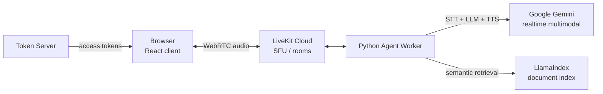

# AI Voice Agent — Real-Time Conversational AI with RAG

A real-time **voice AI agent** that holds natural spoken conversations grounded in your own documents. Built on **LiveKit** WebRTC infrastructure with **Google Gemini** for reasoning and **LlamaIndex** for retrieval-augmented answers — the same architecture pattern behind modern AI call agents.


---

## What it does

- The user speaks in the browser; audio streams over **WebRTC (LiveKit)** to a Python agent worker
- The agent transcribes, reasons with **Gemini**, and answers **out loud** in real time
- With the RAG agent variant, answers are grounded in your indexed documents via **LlamaIndex** — the agent can answer company-specific questions instead of hallucinating

## Architecture



## Agent variants (backend/)

| File | What it demonstrates |
|---|---|
| `simple_gemini_agent.py` | Minimal voice agent — STT → Gemini → TTS loop |
| `realtime_gemini_agent.py` | Gemini's realtime multimodal API for low-latency speech-to-speech |
| `gemini_rag_agent.py` | **Main agent** — voice conversation grounded in documents via RAG |
| `rag_llamaindex.py` | LlamaIndex ingestion & query pipeline (index stored in `storage/`) |
| `token_server.py` | Issues LiveKit room access tokens to the frontend |

## Key Features

- **Sub-second voice loop** using LiveKit's agent framework and Gemini realtime
- **Document-grounded answers** (RAG) — drop files in, the agent answers from them
- **Clean separation**: token issuance, agent logic, and retrieval are independent modules
- **Free-tier friendly**: LiveKit Cloud free tier + Gemini free API quota

## Getting Started

### Prerequisites
- Python 3.9+, Node.js 16+
- [LiveKit Cloud](https://cloud.livekit.io/) account (free) — WebSocket URL, API key & secret
- [Gemini API key](https://aistudio.google.com/) (free tier)

### 1. Backend

```bash
cd backend
python -m venv venv
source venv/bin/activate        # Windows: venv\Scripts\activate
pip install -r requirements.txt
cp .env.example .env            # fill in LIVEKIT_URL, LIVEKIT_API_KEY, LIVEKIT_API_SECRET, GEMINI_API_KEY
```

### 2. Frontend

```bash
cd frontend
npm install
# create frontend/.env with REACT_APP_LIVEKIT_URL (and token endpoint if customized)
```

### 3. Run

```bash
# Terminal 1 — the voice agent
cd backend && python gemini_rag_agent.py dev

# Terminal 2 — the web client
cd frontend && npm start        # opens http://localhost:3000
```

Speak into your microphone and the agent answers in real time.

## Tech Stack

**LiveKit Agents** (WebRTC, turn-taking, audio pipeline) · **Google Gemini** (LLM + realtime speech) · **LlamaIndex** (document indexing & retrieval) · **FastAPI/Flask token server** · **React** frontend

## Challenges solved

- Keeping end-to-end voice latency low enough for natural conversation (streaming pipeline, realtime API)
- Grounding spoken answers in documents without breaking conversational flow
- Correct LiveKit token/room lifecycle between frontend and agent worker

## Roadmap

- [ ] Barge-in (interrupt the agent mid-answer)
- [ ] Persistent vector store (Qdrant) instead of local index
- [ ] Call transcripts & analytics dashboard
